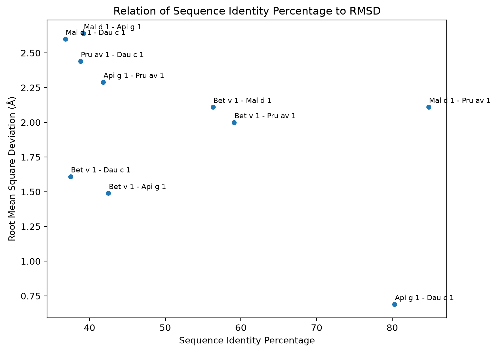
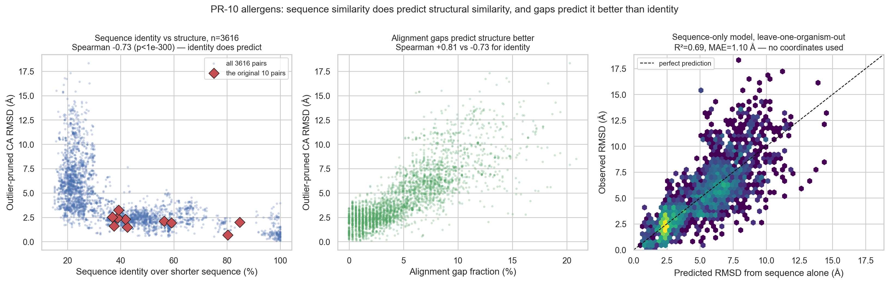

# PR-10 allergen comparison

Does sequence similarity predict structural similarity among PR-10 plant allergens?



Extended analysis (86 proteins, 3616 pairs):



## Background

People with birch pollen allergy often react to raw apple, cherry, celery and carrot. The
reaction is usually limited to the mouth and lips, and it disappears when the food is cooked.
This is oral allergy syndrome (also called pollen-food allergy syndrome).

The cause is cross-reactivity. IgE antibodies raised against the birch pollen allergen
**Bet v 1** also bind structurally similar proteins in those foods. All of them belong to the
**PR-10** protein family and share the same fold.

The epitopes involved are **conformational**: the antibody recognises a patch of surface
residues that are far apart in the sequence but adjacent in the folded structure. That is why
cooking abolishes the reaction — heat unfolds the protein and the patch stops existing.

Because recognition depends on the folded surface rather than the sequence, sequence identity
may be a poor proxy for whether two allergens cross-react. This project tests how well the two
measures agree.

---

## Original analysis: 5 proteins, 10 pairs

Five experimental structures from the RCSB PDB:

| PDB | Allergen | Source | Method |
|---|---|---|---|
| 1BV1 | Bet v 1 | birch pollen | X-ray |
| 5MMU | Mal d 1 | apple | NMR |
| 1E09 | Pru av 1 | cherry | NMR |
| 2BK0 | Api g 1 | celery | X-ray |
| 2WQL | Dau c 1 | carrot | X-ray |

For each of the 10 pairs: extract sequence and CA atoms, align globally with BLOSUM62
(gap open −11, gap extend −1), pair up the aligned residues, then take identity over the
shorter sequence and RMSD from a Biopython `Superimposer` fit over every aligned pair.

The result, in [`allergen_comparison.csv`](allergen_comparison.csv):

| Pair | Sequence identity | RMSD |
|---|---|---|
| Api g 1 – Dau c 1 (celery/carrot) | 80.3% | **0.69 Å** — most similar structure |
| Mal d 1 – Pru av 1 (apple/cherry) | **84.8%** — most similar sequence | 2.11 Å |

The most sequence-similar pair is not the most structurally similar, which motivated the
claim that **sequence identity does not predict structural similarity**.

## Why that claim does not hold

n=10 cannot support it. The correlation behind the scatter plot is not significant, and it is
carried entirely by one point:

| | Pearson r | p |
|---|---|---|
| all 10 pairs | −0.503 | 0.139 |
| without Api g 1 – Dau c 1 | **−0.137** | 0.724 |

Api g 1 – Dau c 1 is the only X-ray/X-ray comparison in the set, so the one pair that breaks
the trend is also the one pair whose measurement is not confounded. Drop it and there is no
trend left at all.

Four further problems in the original code:

- **`percent_identity` divides by the shorter sequence**, so a pair where one protein is 7
  residues longer is scored on a denominator that ignores those residues. No coverage figure
  is reported, so alignment gaps and missing residues are invisible in the output.
- **NMR entries use model 0.** 5MMU and 1E09 are ensembles of 20 and 22 models; their internal
  spread is 0.74 ± 0.09 Å and 0.79 ± 0.13 Å. That is comparable to the differences being
  measured, and it was an arbitrary choice of conformer.
- **Chain "A" is hard-coded** (`data_creation.ipynb`). That works for these five entries and
  breaks on any entry where A is a Fab, a ligand, or absent.
- **No outlier pruning in the RMSD**, so the values are inflated relative to tools that prune
  iteratively (ChimeraX `matchmaker`).

Also: `allergen_functions.py` reimplements BLOSUM alignment and Biopython superimposition that
the library already provides, and `percent_identity` re-parses both sequences on every call
after `allergen_comparison` had already parsed them.

---

## Extended analysis: 86 proteins, 3616 pairs

The fix for a sample-size problem is a bigger sample. The PR-10 family is InterPro
**IPR000916** plus **IPR024949**, which is how the entries were found:

- **133** structures from the RCSB
- **86** unique protein sequences after collapsing entries that are the same protein
- **24** plant species
- **3616** pairs

Three deliberate changes to the method, each fixing a problem above:

1. **NMR ensembles are averaged over all models** instead of taking model 0, and the ensemble
   spread is recorded per protein.
2. **RMSD is outlier-pruned** (iterative two-sigma cut, floor of 30 pairs), so the target
   matches what ChimeraX `matchmaker` reports. Both raw and pruned values are in `pairs.csv`.
3. **Identity is reported two ways** — over the shorter sequence (as before) and over aligned
   columns — so coverage is visible.

### Sequence similarity does predict structural similarity

Spearman correlation against RMSD, n=3616:

| Feature | ρ |
|---|---|
| **gap fraction** | **+0.815** |
| hydrophobicity profile correlation | −0.736 |
| identity over shorter sequence | −0.731 |
| BLOSUM score per aligned column | −0.719 |
| identity over aligned columns | −0.716 |
| epitope identity | −0.638 |

All significant at p < 1e-300. The original conclusion was an artefact of n=10, not a finding.

The interesting part is which feature wins. **Alignment gap fraction beats sequence identity.**
Gaps mark insertions and deletions, and PR-10 length varies from 118 to 169 residues across
these species, so a large gap fraction means genuinely different architecture, not just
substitutions. Identity saturates — once two PR-10 proteins are past ~50% identical, further
identity does not move RMSD much, while a new insertion still does.

### A sequence-only model

Gradient boosting on eight features, all computable from two sequences and never from
coordinates, so a new allergen can be scored before anyone solves a structure for it.

Leave-one-**organism**-out CV. Pairwise data cannot be split by protein — every pair has two
proteins, so a protein-level split still leaves the held-out protein's relatives in training —
so whole organisms are held out, and a pair is scored only when both its organisms are unseen.

| Model | R² | MAE (Å) | \|error\| < 1 Å |
|---|---|---|---|
| all 8 features | **0.686** | 1.10 | 61.2% |
| all 8 features, ridge | 0.681 | 1.15 | 58.9% |
| identity only | 0.467 | 1.45 | 53.7% |
| identity only, ridge | 0.347 | 1.78 | 32.2% |
| predict family mean | 0.000 | 2.30 | — |

Permutation test (20 shuffles within folds): real R²=0.686 against a null of 0.030 ± 0.014.

So sequence alone gets you most of the way to the structure — 0.69 R² with no coordinates at
all — and the non-identity features are worth more than identity is (0.686 vs 0.467). What it
cannot do is replace a structure: 1.1 Å mean error is fine for triage and useless for
measuring a 0.69 Å difference between two homologues.

**This predicts structural deviation, not cross-reactivity.** It says how far apart two
structures will lie. Whether IgE actually binds is a separate question needing clinical data.

### The epitope hypothesis came back reversed

The original README proposed that the residues the IgE Fab touches in **9Y0A** (Bet v 1.0101 +
human Fab 2H22) might be more conserved in the food allergens than the protein as a whole.
Extracted epitope: 16 residues within 4.5 Å of the Fab, `ETATNFKVATPDGILK`.

Tested as a paired comparison over all 3616 pairs, BLOSUM score at epitope positions vs the
rest of the same alignment:

| Epitope definition | Epitope | Background | Difference | p |
|---|---|---|---|---|
| 4.0 Å | 1.554 | 1.870 | **−0.316** | 2.6e-151 |
| 4.5 Å | 1.485 | 1.880 | **−0.395** | 9.5e-213 |
| 5.0 Å | 1.491 | 1.886 | **−0.395** | 6.1e-206 |

The epitope positions are significantly **less** conserved than background, not more — and this
is not a positional artefact: random patches of the same size give +0.024 on average (range
−0.405 to +0.388 over 20 draws), so the real epitope is a genuine outlier, just on the other
side.

The epitope also earns its place as a feature only weakly: it correlates +0.887 with plain
identity and adds nothing to the model (leave-one-out ΔR² = −0.003).

The reading: the residues IgE recognises sit in the most variable part of the fold. If IgE
binding were driven by conservation of the contact patch, the patch would be the most
conserved region. It is the least. Conformational diversity at the epitope looks like the thing
that distinguishes one allergen from another, which is also why the family tolerates it — the
variable surface is the part that needed to vary.

## Limitations

- **RMSD is a proxy for cross-reactivity, not a measure of it.** No clinical data is used
  anywhere. Structural similarity is necessary for IgE cross-reactivity and nowhere near
  sufficient.
- **One IgE, one allergen.** The epitope comes from a single Fab (2H22) bound to Bet v 1.0101.
  IgE repertoires differ between people, and Bet v 1 has many isoforms. The epitope-feature
  result is specific to this one complex.
- **Structure quality is still uneven.** 70 X-ray at 1.14–3.1 Å against 16 NMR ensembles, whose
  median internal spread is 0.72 Å. The spread is recorded per protein and averaged out, but it
  is not zero.
- **Coordinate-derived gap fraction is a proxy for real indels.** Gap fraction comes from the
  alignment, so it partly reflects the aligner's gap penalty as much as the biology. The
  -11/-1 parameters were inherited from the original analysis and never tuned.
- **One family.** PR-10 is unusually conserved and unusually uniform in architecture. R²=0.686
  should not be assumed to transfer to another allergen family.
- **Pairwise rows are not independent.** 3616 pairs from 86 proteins are ~5% of the information,
  not 3616 independent observations. The organism-level CV accounts for this; the raw p-values
  in the correlation table do not.

## Files

| File | |
|---|---|
| `allergen_functions.py` | original analysis functions, unchanged |
| `allergen_comparison.csv` | the original 10 pairs |
| `data_creation.ipynb` | builds the original 10 pairs |
| `figure.ipynb` | produces `identity_vs_rmsd.png` |
| `pdb_files/` | the original five structures |
| `fetch_data.py` | finds and downloads all 133 PR-10 entries from the RCSB |
| `pipeline.py` | dataset construction: proteins, epitope, pairs, features |
| `build_dataset.py` | writes `pairs.csv` |
| `model.py` | sequence-only model + leave-one-organism-out CV |
| `make_figure.py` | produces `identity_vs_rmsd_family.png` |
| `screen.py` | CLI to score a pair of sequences for predicted structural deviation |
| `epitope_analysis.py` | the epitope conservation test |
| `test_pipeline.py` | assertions for the geometry and dataset code |

## Running it

Original analysis, unchanged:

```
python3 -m venv .venv
source .venv/bin/activate
pip install biopython pandas matplotlib seaborn jupyter adjustText
```

Then run `data_creation.ipynb` followed by `figure.ipynb`.

Extended analysis:

```
pip install biopython numpy pandas scipy scikit-learn matplotlib seaborn

python3 fetch_data.py        # ~1 min: 133 structures into pdb_all/ (gitignored)
python3 test_pipeline.py     # ~1 min: assertions, including the original RMSD values
python3 build_dataset.py     # ~20 s: pairs.csv, 3616 pairs
python3 model.py             # ~40 s: correlations and CV scores
python3 model.py --full      # ~15 min: permutation test and feature importances
python3 epitope_analysis.py  # ~1 min: the epitope conservation test
python3 make_figure.py       # ~30 s: identity_vs_rmsd_family.png

python3 screen.py --betv1 my_allergen.fasta   # screen a new sequence
```

### Screening a new allergen

`screen.py` takes FASTA (or a bare sequence, or `-` for stdin) and prints a
predicted RMSD with a triage band. This is the practical use: no structure needed.

```
$ python3 screen.py --betv1 celery_Api_g_1.fasta
epitope: 16 IgE-contact positions from 9Y0A, anchored on 1BV1

Bet v 1 (1BV1) (159 aa)  vs  celery_Api_g_1.fasta (153 aa)
  identity over shorter seq 42.5%   epitope identity 38%   gaps 1.9%
  predicted RMSD 2.21 A   ->  moderate - same fold, region differences
```

Sanity checks against known pairs, which show where the model stops being useful:

| Pair | Predicted | Observed | |
|---|---|---|---|
| Bet v 1 – Api g 1 | 2.21 Å | 1.49 Å | overestimates by 0.72 Å |
| Bet v 1 – Dau c 1 | 2.21 Å | 1.61 Å | overestimates by 0.60 Å |
| Api g 1 – Dau c 1 | 1.52 Å | **0.69 Å** | overestimates by 0.83 Å |

At ~1.1 Å MAE the model reliably separates "same fold" from "divergent
architecture". It cannot resolve a 0.7 Å difference between close homologues,
which is exactly what the original five-protein analysis was measuring.

`pdb_all/` holds 140 MB of RCSB coordinates and is gitignored; `fetch_data.py` rebuilds it.

## Notes

Written by MS as a self-directed project. The extended analysis was added later; the
original five-protein result is kept intact above so the two can be compared.